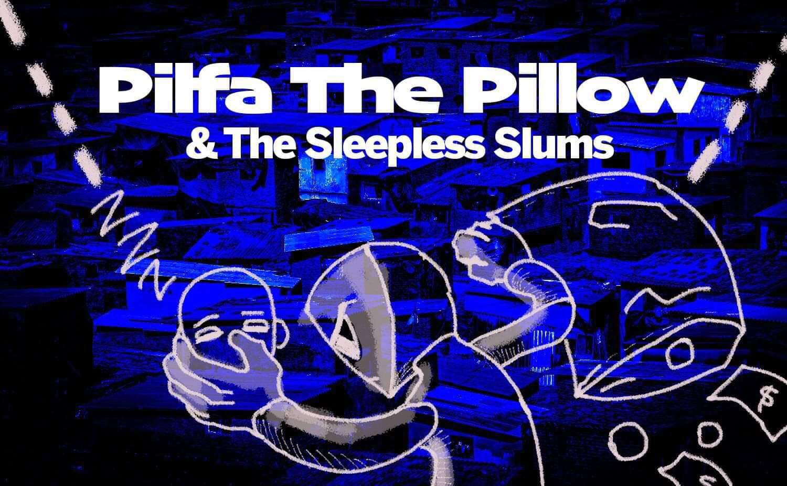

# Pillow and the Sleepless Slums

## Description
"Pillow and the Sleepless Slums" is a precision stealth 2D platformer where players navigate through a world of insomnia and dreams. As Pillow, a small hero in a big world, you must sneak, jump, and puzzle your way through the Sleepless Slums, avoiding detection and overcoming obstacles.

## Features
- Precision platforming mechanics
- Stealth-based gameplay
- Challenging puzzles and obstacles
- [Add more specific features of your game]

## Installation
1. Clone the repository: `git clone hamzasehavdic/pillow-and-the-sleepless-slums`
3. [Any additional setup steps]

## Usage / Building Runnable Game
Do x ...

## Controls
- Left/Right Arrow: Move
- Space: Jump
- t Key: Interact
- o Key: Dash
- p Key: Melee Attack
- [Add other controls specific to your game]

## Development
- Built with Godot 4
- [Any specific development tools or requirements]

## License
This license allows others to:
- Share — copy and redistribute the material in any medium or format
- Adapt — remix, transform, and build upon the material for any purpose, even commercially

Under the following terms:
- Attribution — You must give appropriate credit to the creators, provide a link to the license, and indicate if changes were made.

## Contact
- Concept & Art: Omar Kazami - omarkazami2015@gmail.com
- Art*: Hamza Kazami - email_here
- Programming: Hamza Sehavdic - hsehavdic@gmail.com
[Your contact information or ways for people to reach out about the game]

